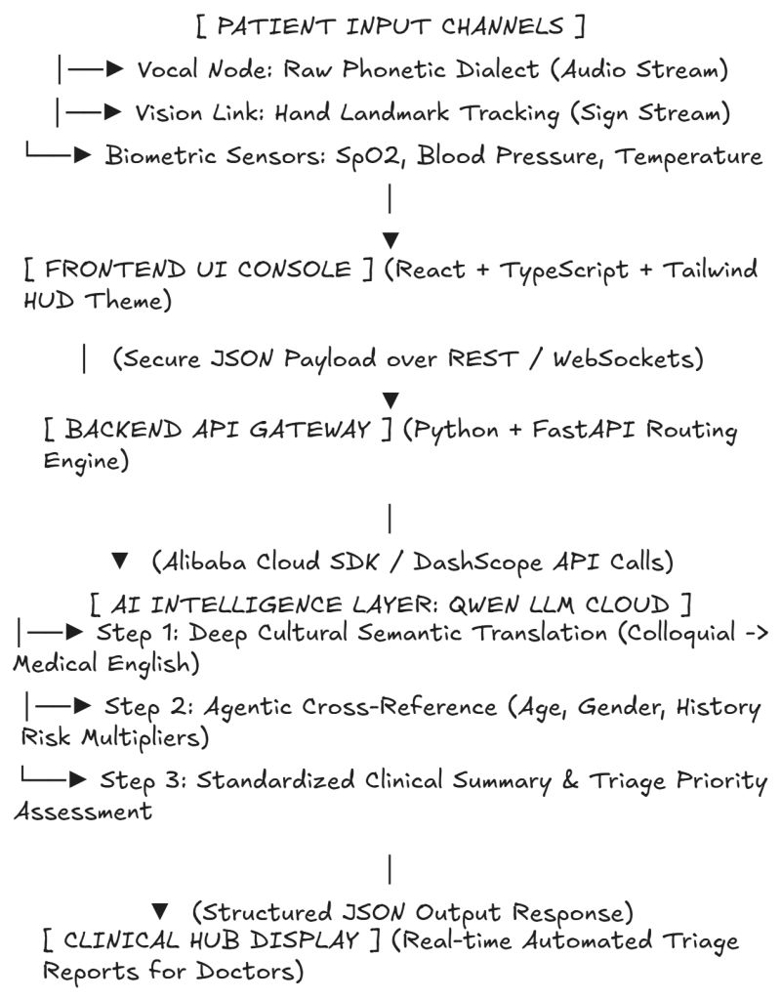

# MediLogue: AI-Powered Dialect & Triage Engine

MediLogue is an AI-driven triage assistant designed to bridge the communication gap between patients speaking local dialects and healthcare providers. By utilizing Alibaba Cloud Qwen LLM, the system translates diverse local expressions into standardized clinical terminology, ensuring accurate medical intake in underserved regions.

## 🚀 Key Features

* **Dialect-to-Clinical Translation**: Translates regional linguistic patterns (e.g., Sabahan Malay dialects) into professional English medical terminology.
* **Powered by Qwen LLM**: Leverages the advanced natural language understanding of Alibaba Cloud's Qwen model to interpret nuanced medical intent.
* **"Plug-and-Play" Architecture**: Easily adaptable to new regions or languages by simply updating the reference dataset (`data_dialek.txt`) without requiring code changes.
* **Global Healthcare Inclusivity**: Removes language barriers for marginalized communities, ensuring patients in rural or remote areas receive accurate diagnoses.
* **Lightweight & Scalable**: Optimized for low-resource hardware, making it suitable for deployment in remote clinics worldwide.

## 🛠️ Architecture

*(Sila letakkan gambar arkitektur anda di sini menggunakan format: )*

The system architecture connects the frontend (Streamlit) to the backend, which processes input through the Alibaba Cloud Qwen API. The backend cross-references local dialect datasets before generating a standardized clinical analysis.

## ☁️ Alibaba Cloud Deployment

This project is powered by Alibaba Cloud. The backend integration uses the Qwen API to perform high-fidelity medical language processing.

* **Deployment Proof**: [Link to your code file in the repo showing API usage]

## 📝 License

This project is licensed under the MIT License - see the LICENSE file for details.
