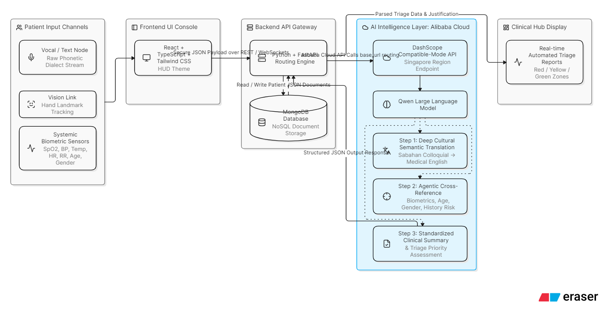

# MediLogue: AI-Powered Dialect & Triage Engine

**Submission for OpenAI Build Week (Apps for Your Life - Health Track)**

## 🚨 The Problem

In rural and underserved regions (such as Sabah, Malaysia), medical personnel often face critical communication barriers when triaging patients who speak deep local dialects. Misinterpreting colloquial symptom descriptions can lead to delayed treatments or fatal misdiagnoses in emergency rooms.

## 💡 The Solution

MediLogue is an AI-driven triage assistant that acts as a real-time clinical bridge. By leveraging the advanced reasoning capabilities of **OpenAI GPT-5.6**, the system instantly translates non-standard regional expressions into professional, structured clinical terminology, prioritizing emergency levels (e.g., Red Zone) for immediate medical intake.

## 🚀 Key Features

- **Dialect-to-Clinical Translation**: Translates regional linguistic patterns directly into professional English medical terminology using GPT-5.6.
- **Diagnostic Reasoning**: Infers medical urgency and categorizes patients based on clinical triage standards.
- **Global Healthcare Inclusivity**: Removes language barriers for marginalized communities, ensuring patients in remote areas receive accurate preliminary diagnoses.
- **"Plug-and-Play" Architecture**: Easily adaptable to new regions or languages by simply updating the context prompts.

---

## 🤖 OpenAI Build Week: Collaboration & Implementation

This project existed prior to the hackathon but was **meaningfully extended** during the submission period by replacing its core diagnostic engine with GPT-5.6 and utilizing Codex for rapid database and API development.

### How GPT-5.6 Contributed to the Final Result

GPT-5.6 is the core "brain" of MediLogue's backend architecture. We integrated it via the FastAPI backend to replace standard keyword-matching. GPT-5.6 is specifically prompted to:

1. Analyze the raw, dialect-heavy text input.
2. Perform clinical reasoning to identify the underlying medical intent.
3. Output a strictly formatted JSON response containing the standardized symptoms, recommended medical department, and triage urgency level to be rendered by the React frontend.

### How Codex Accelerated Development

Codex was instrumental in accelerating the backend restructuring for this hackathon. We collaborated with Codex to:

- **Database Generation**: Automatically draft the MongoDB required to store patient triage logs.
- **API Routing**: Rapidly generate the FastAPI endpoints (`app.py`) to connect the React frontend securely with the OpenAI API.
- **Testing Scripts**: Write Python-based unit tests to ensure the JSON outputs from GPT-5.6 were correctly parsed before hitting the database.

**Codex Session ID:** `/feedback [INSERT_YOUR_SESSION_ID_HERE_LATER]`

---

## 🛠️ Architecture

_(Sila letakkan gambar arkitektur anda di sini menggunakan format: )_

The system architecture features a React-based frontend that provides a seamless user interface, connected to a robust FastAPI (Python) backend which processes clinical input through the OpenAI API, with data persisted in a PostgreSQL database.

---

## 🧪 Testing Instructions for Judges

We have made the repository fully testable. Please follow these steps to run the MediLogue triage system locally.

### Prerequisites

- Node.js (v16+)
- Python (3.10+)
- MongoDB

### 1. Backend Setup (FastAPI)

```bash
# Navigate to backend directory
cd backend

# Install dependencies
pip install -r requirements.txt

# Create a .env file and add your OpenAI API key
echo "OPENAI_API_KEY=your_api_key_here" > .env

# Run the backend server
uvicorn app:app --reload
```
